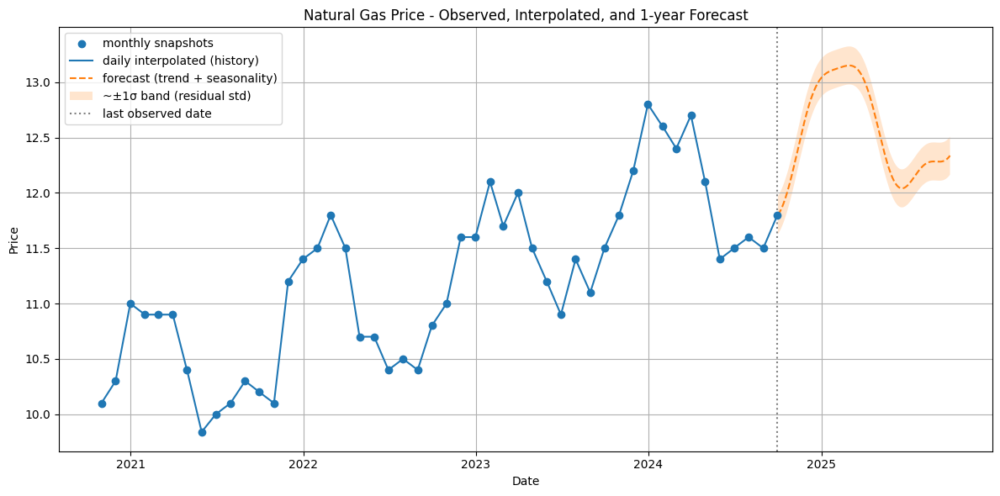

# JPMorgan-Virtual-Internship-Tasks
Data analysis and forecasting tasks completed as part of the J.P. Morgan Chase &amp; Co. Virtual Internship on Forage.
# J.P. Morgan Virtual Internship (Forage)
**Role:** Quantitative Research / Data Analysis  
**Intern:** Nagesh Awachar  

---

### Task 1: Natural Gas Price Analysis

- Analyzed monthly natural gas prices (Oct 2020 – Sep 2024)
- Built a Python model to interpolate and forecast prices for 1 year ahead
- Visualized trends using Matplotlib
- Tools used: Python, Pandas, NumPy, Matplotlib, scikit-learn

#### Key Learnings:
- Time series forecasting
- Data visualization & trend analysis
- Data-driven decision making in financial markets

---

### Output Preview:

---

###  Code
Check out the notebook: [Task_1_JPMorgan.ipynb](Task_1_JPMorgan.ipynb)

---

> Completed as part of the **J.P. Morgan Chase & Co. Virtual Internship** on the Forage platform.
